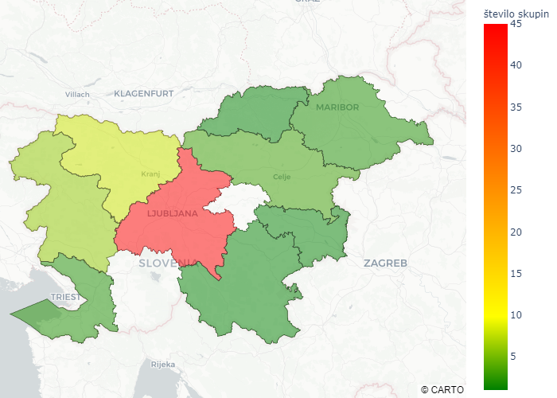

# Analiza gibanja igralcev igre Geocaching v času COVID-19 v Sloveniji

## Dokumenti.

V mapi [results](https://github.com/kkklemennn/analiza-geocaching-covid/tree/master/doc/results/slike) se nahajajo vse slike analiz.

## Slike z opisi

### Primerjave aktivnih uporabnikov in najdb zakladov

Graf aktivnih uporabnikov v 2020 in 2021 v primerjavi s povprečjem od 2017 do 2019:

Graf najdb v 2020 in 2021 v primerjavi s povprečjem od 2017 do 2019:

Graf aktivnih domačih in tujih igralcev v 2020 in 2021 v primerjavi s povprečjem od 2017 do 2019:

Graf najdb domačih in tujih igralcev v 2020 in 2021 v primerjavi s povprečjem od 2017 do 2019:

### Primerjave z Apple Mobility Trends

Vizualizacija podatkov iz Apple Mobility Trends:

Graf števila aktivnih uporabnikov igralcev igre Geocaching v primerjavi s podatki uporabniških zahtev za navodila za pot na aplikaciji Apple zemljevidi:

### Primerjave z Google Mobility Trends

Vizualizacija podatkov iz Google Mobility Trends:

Graf primerjave števila aktivnih uporabnikov igre Geocaching in podatki Googlovih trendov mobilnosti:

### Kako so se igralci držali ukrepov (prehajanja po občinah in regijah)

Graf občin, kamor so se igralci v času ukrepov omejitev prehajanja občine prebivališča odpravljali iskat zaklade:

Graf prehajanja igralcev po občinah, kjer eno prehajanje predstavlja en igralni dan enega igralca v tuji občini oz. regiji. Po barvah so ločena območja domov igralcev:

Graf prehajanja igralcev po regijah, kjer eno prehajanje predstavlja en igralni dan enega igralca v tuji občini oz. regiji. Po barvah so ločena območja domov igralcev:

Graf prehajanja igralcev po občinah, kjer eno prehajanje predstavlja enega igralca v tuji občini oz. regiji kadarkoli v času veljavnih ukrepov. Po barvah so ločena območja domov igralcev:

Graf prehajanja igralcev po regijah, kjer eno prehajanje predstavlja enega igralca v tuji občini oz. regiji kadarkoli v času veljavnih ukrepov. Po barvah so ločena območja domov igralcev:

Normaliziran graf prehajanja regij, ki prikazuje odstotek prehajanja igralcev iz posamezne občine:

Normaliziran graf prehajanja regij, ki prikazuje odstotek prehajanja igralcev iz posamezne regije:

### Iskanje skupin, ki igrajo skupaj

Primerjavo števila najdb prvih 10 skupin po številu najdb za časa veljavnih ukrepov in zadnjih treh let pred COVID-19:

Zemljevid regij s pripadajočim številom skupin, ki so se družile:

### Primerjava gibanja oseb s podatki števila najdb zakladov ter števila potrjenih primerov COVID-19

Vizualizacija podatkov iz COVID-19 Sledilnika:

Graf primerjave števila najdb Geocaching zakladov in potrjenih COVID-19 primerov na dan:

### Primerjave po tipih zakladov

Graf števila najdb zakladov različnih tipov. Rdeč pas predstavlja obravnavano časovno obdobje COVID-19:

Graf normaliziranjega števila najdb (glede na število vseh skritih zakladov pripadajočega tipa) zakladov različnih tipov. Rdeč pas predstavlja obravnavano časovno obdobje COVID-19:

### Določanje lokacije uporabnikom

Primer skupin zakladov za testnega uporabnika (lokacija katerega je predstavljena z rumeno piko), prikazanih na zemljevidu. Z rdečo barvo so prikazani zakladi skupine _FTF-jev_, z modro _skriti_ zakladi, z zeleno pa zakladi _prvih treh iskalnih dni_:

